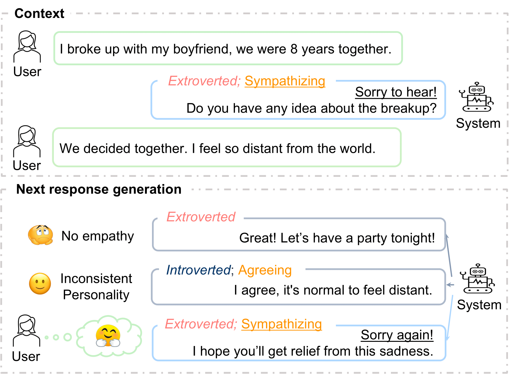
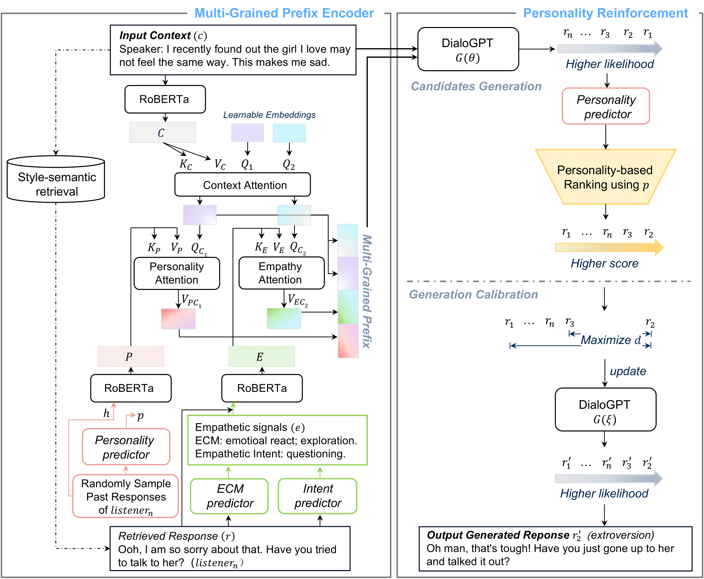

The official codes for the paper: Yahui Fu, Chenhui Chu, Tatsuya Kawahara. "[StyEmp: Stylizing Empathetic Response Generation via Multi-Grained Prefix Encoder and Personality Reinforcement](https://arxiv.org/pdf/2408.02271)." SIGDIAL 2024.

If you find this repository or paper useful, please kindly cite our paper:
```
@article{fu2024styemp,
  title={StyEmp: Stylizing Empathetic Response Generation via Multi-Grained Prefix Encoder and Personality Reinforcement},
  author={Fu, Yahui and Chu, Chenhui and Kawahara, Tatsuya},
  booktitle={Proceedings of the 25th Annual Meeting of the Special Interest Group on Discourse and Dialogue},
  year={2024}
}
```
### **Abstract**
<p style="text-align: justify;">
Recent approaches for empathetic response
generation mainly focus on emotional resonance and user understanding, without considering the system’s personality. Consistent personality is evident in real human expression
and is important for creating trustworthy systems. To address this problem, we propose
StyEmp, which aims to stylize the empathetic
response generation with a consistent personality. Specifically, it incorporates a multi-grained
prefix mechanism designed to capture the intricate relationship between a system’s personality and its empathetic expressions. Furthermore, we introduce a personality reinforcement
module that leverages contrastive learning to
calibrate the generation model, ensuring that
responses are both empathetic and reflective
of a distinct personality. Automatic and human evaluations on the EMPATHETICDIALOGUES benchmark show that StyEmp outperforms competitive baselines in terms of both
empathy and personality expressions.
</p>


<div align="center">
  
</div>


### **Model Architecture:


### **Preparing Environment
```
```
